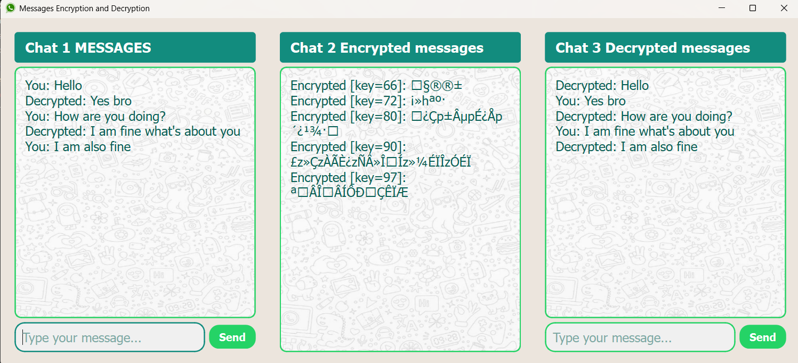

# 🔐 Messages Encryption & Decryption Chat With PYQT6 GUI

A simple desktop chat application built with **Python** and **PyQt6** that demonstrates real-time message encryption and decryption between two users through an intermediate encrypted chat screen.

---

## 📸 Screenshot



---

## ✨ Features

- Three-panel chat interface
- Real-time message encryption
- Automatic decryption after encryption
- Send messages using **Send button** or **Enter key**
- WhatsApp-style visual layout
- Dynamic time-based encryption key
- Separate display for:
  - Original message
  - Encrypted message
  - Decrypted message

---

## ⚙️ How It Works

1. User sends a message from **Chat 1** or **Chat 3**
2. The message is encrypted using a time-based key
3. The encrypted text appears in **Chat 2**
4. The same key is used to decrypt the message
5. The decrypted output appears in the receiving chat

---

## 🔐 Encryption Logic

This project uses a simple character-shifting encryption method.

- Each character is shifted forward using a numeric key
- The same key is used to shift characters backward during decryption

> Note: This method is for educational purposes only and is not suitable for real-world security.

---

## 🛠️ Technologies Used

- Python
- PyQt6

---

## 📁 Project Structure

```text
Message_Encryption_Decryption/
│
├── demo5.py
├── encp3.py
├── chat_background2.png
├── whatsapp_logo.png
├── screenshot.png
└── README.md

